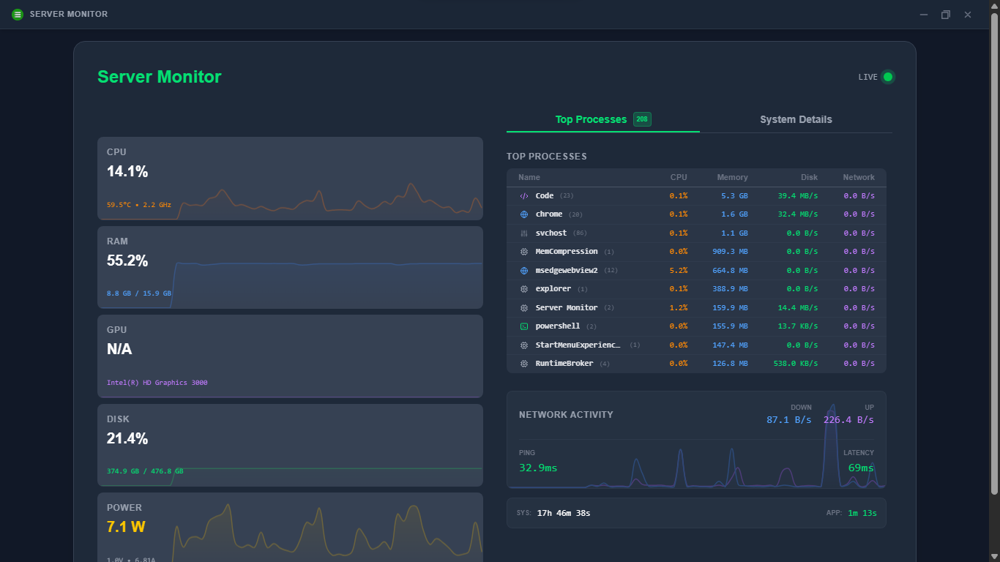
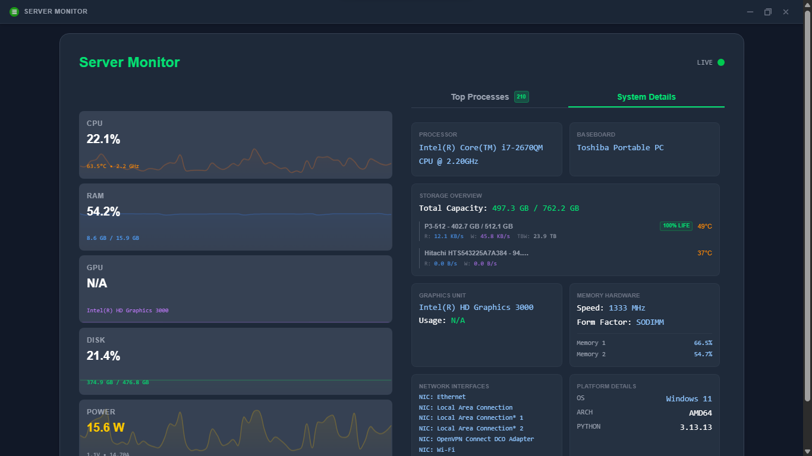

# Server Monitor Dashboard

A professional, cross-platform server monitoring tool with a real-time web dashboard and a standalone desktop GUI. Built with Python, Flask-SocketIO, and Tailwind CSS.

## 🚀 Features

- **Layered Hardware Cards**: Real-time monitoring for CPU, RAM, GPU, Disk, and Power with integrated background sparklines for historical context.
- **Process Intelligence**: Advanced grouping of system processes with auto-cleaned names (no `.exe`), instance counting, and keyword-based smart icons.
- **Network Analytics**: Unified dual-dataset visualization for Upload/Download speeds with real-time ping and browser latency tracking.
- **Premium Aesthetics**: Custom HTML tooltips with backdrop-blur effects, smooth sliding animations, and centralized backend theme management.
- **Data Precision**: All units (GB, MB, KB/s) are formatted on the backend for consistency, with normalized CPU reporting across all logical cores.
- **Desktop GUI**: A standalone, frameless desktop experience powered by `pywebview` with integrated window controls.
- **Cross-Platform**: Tailored optimizations for Windows (LHM/WMI), Linux (sysfs), and Android (Termux).

## 📸 Screenshots

| Dashboard View | System Details |
| :---: | :---: |
|  |  |


## 🛠️ Tech Stack

- **Backend**: Python, Flask-SocketIO, Gevent (High-concurrency networking).
- **Frontend**: Tailwind CSS v4, Chart.js (Custom sparklines), Socket.IO Client.
- **Monitoring**: Psutil, GPUtil, LibreHardwareMonitor (via PythonNet), WMI.
- **GUI**: PyWebView (Edge Chromium engine support).

## 📦 Installation

### Prerequisites
- Python 3.7 or higher.
- NVIDIA Drivers (optional, for GPU load monitoring).

### Windows
1. Run the setup script to create a virtual environment and install dependencies:
   ```cmd
   setup.bat
   ```
2. Activate the environment:
   ```cmd
   .venv\Scripts\activate
   ```
3. Run the application:
   ```cmd
   python server_monitor.py
   ```

### Linux (Debian/Ubuntu)
1. Run the setup script (installs system dependencies for the GUI):
   ```bash
   chmod +x setup.sh
   ./setup.sh
   ```
2. Activate the environment and run:
   ```bash
   source .venv/bin/activate
   python3 server_monitor.py
   ```

### Android (Termux)
1. Install **Termux** (recommended via F-Droid).
2. Update the environment and install Python along with build tools:
   ```bash
   pkg update && pkg upgrade
   pkg install python clang make
   ```
3. Install the required Python packages:
   ```bash
   pip install -r requirements.txt
   ```
4. Start the monitoring server:
   ```bash
   python server_monitor.py
   ```
   *Note: On Termux, the app will automatically fall back to browser mode. Use the Local IP provided in the terminal to access the dashboard from your mobile browser.*

## 🏗️ Building the Executable (Windows)

To bundle the application into a single standalone `.exe` file with UPX compression:
```cmd
.\build_exe.bat
```
The output will be located in the `dist/` folder.

## 📂 Project Structure

```text
server_monitor/
├── monitor_core/       # Core hardware monitoring and utility logic
├── static/             # Frontend assets (CSS, JS, Icons)
├── templates/          # HTML templates (Jinja2)
├── server_monitor.py   # Application entry point & server logic
├── setup.py            # Package metadata
├── requirements.txt    # Project dependencies
├── build_exe.bat       # Windows build script
└── setup.bat/sh        # Installation scripts
```

## 📝 License

This project is licensed under the MIT License - see the [LICENSE](LICENSE) file for details. Developed by KJAYDev.

## 🙏 Acknowledgements

This project is built upon the incredible work of the open-source community. Special thanks to:

- [LibreHardwareMonitor](https://github.com/LibreHardwareMonitor/LibreHardwareMonitor) - Essential hardware sensing library for Windows sensors.
- [psutil](https://github.com/giampaolo/psutil) - Robust system utilization and process management.
- [Flask-SocketIO](https://github.com/miguelgrinberg/Flask-SocketIO) - Seamless real-time data streaming logic.
- [Tailwind CSS](https://tailwindcss.com/) - The utility-first CSS framework for our modern, responsive UI.
- [Chart.js](https://www.chartjs.org/) - High-performance charting and background sparklines.
- [pywebview](https://github.com/r0x0r/pywebview) - Cross-platform desktop GUI wrapper for the dashboard.
- [GPUtil](https://github.com/anderskm/gputil) - GPU utilization tracking and monitoring.
- [Python.NET](https://github.com/pythonnet/pythonnet) - The bridge allowing Python to interface with .NET hardware libraries.
- [Gemini](https://deepmind.google/technologies/gemini/) - AI companion responsible for code refactoring, architectural optimization, and UI/UX enhancements.

## 🛠️ Development

To set up a local environment for testing or adding new features:

1. **Clone the repository**:
   ```bash
   git clone https://github.com/jakelen61732/server_monitor.git
   cd server_monitor
   ```
2. **Initialize the environment**: Run `setup.bat` (Windows) or `./setup.sh` (Linux).
3. **UI Customization**: The dashboard uses Tailwind CSS. To modify styles, edit `static/style.css`.
4. **Hardware Testing**: You can run `python monitor_core/stats.py` directly to debug raw sensor output in the terminal.
5. **Run in Debug Mode**: Launch with `python server_monitor.py` to see real-time SocketIO logs.

For bundling changes, refer to the `build_exe.bat` script.

## 🛠️ Troubleshooting

### Windows: Sensor Data Missing (N/A)
If hardware metrics like **CPU Temperature**, **GPU Load**, or **Power Consumption** show as `N/A`:

- **Administrator Privileges**: These sensors require direct access to hardware registers. Ensure you are running the terminal (CMD/PowerShell) or the standalone EXE as an **Administrator**.
- **Driver Support**: Ensure you have the latest chipset and GPU drivers installed.
- **UAC Prompt**: The application is designed to request elevation automatically, but if it fails, right-click `server_monitor.py` or the built EXE and select **"Run as Administrator"**.

## 🤝 Contribution

Contributions make the open-source community an amazing place to learn, inspire, and create. Any contributions you make are **greatly appreciated**.

1. **Fork the Project**
2. **Create your Feature Branch** (`git checkout -b feature/AmazingFeature`)
3. **Commit your Changes** (`git commit -m 'Add some AmazingFeature'`)
4. **Push to the Branch** (`git push origin feature/AmazingFeature`)
5. **Open a Pull Request**

For bugs and feature requests, please open an issue.